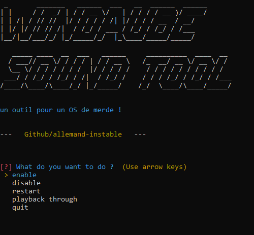
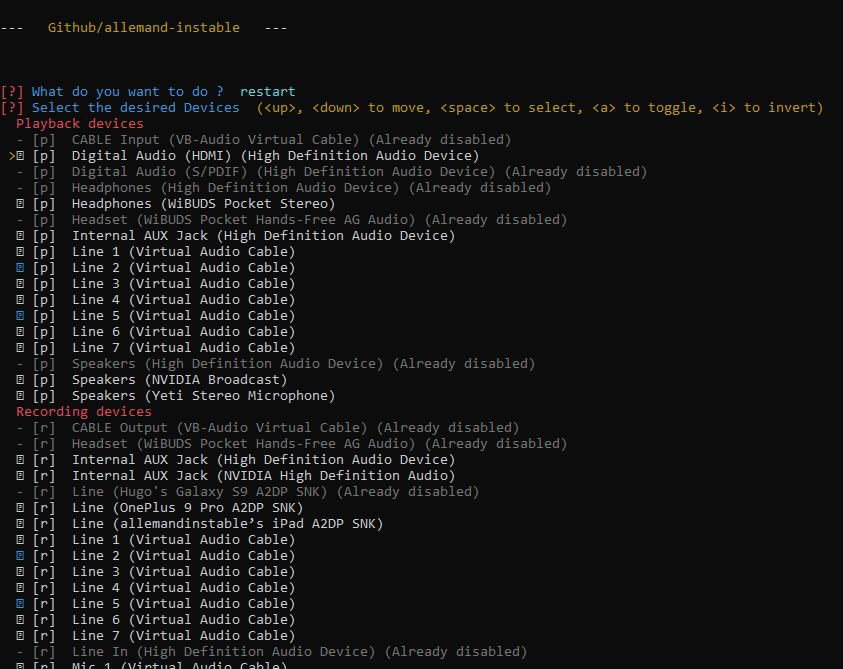
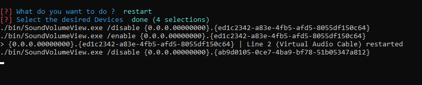
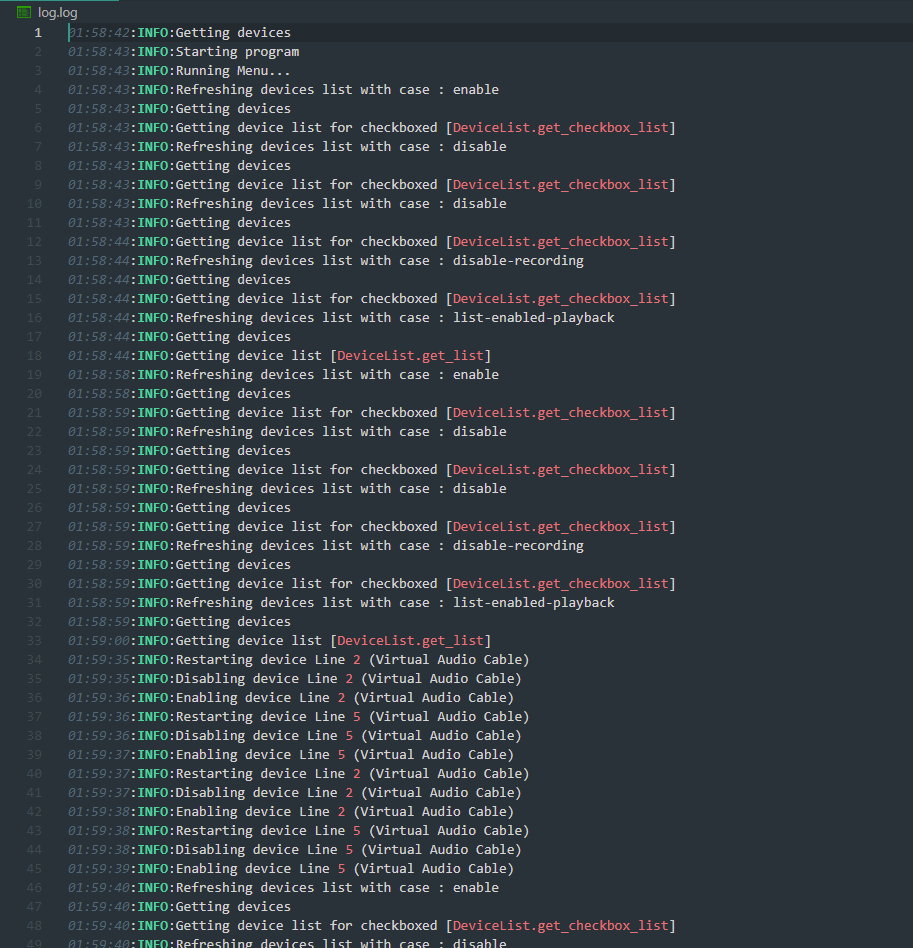

# Windaube Sound Tool
 Windows Sound Device Manipulation Tool written in Python

# features

## interface example

you can select devices with the keyboard or (even) the mouse.

some information is displayed to let the user know what's going on

## current features

### Enable a Sound Device

self explanatory

### Disable a Sound Device

self explanatory

### Restart a Sound Device

self explanatory

### Playback Through

Set through which playback device you want to listen the selected recording devices.

## logging

# dependencies 

- [pycaw](https://github.com/AndreMiras/pycaw)

- SoundVolumeView | Nirsoft (included)

[Official Website](https://www.nirsoft.net/utils/sound_volume_view.html)

License :
> This utility is released as freeware. You are allowed to freely distribute this utility via floppy disk, CD-ROM, Internet, or in any other way, as long as you don't charge anything for this and you don't sell it or distribute it as a part of commercial product. If you distribute this utility, you must include all files in the distribution package, without any modification !

# TODO

- add user preferences | saved within a json
  - add default devices for restart

- Some optimization left to do, even it's overall responsive